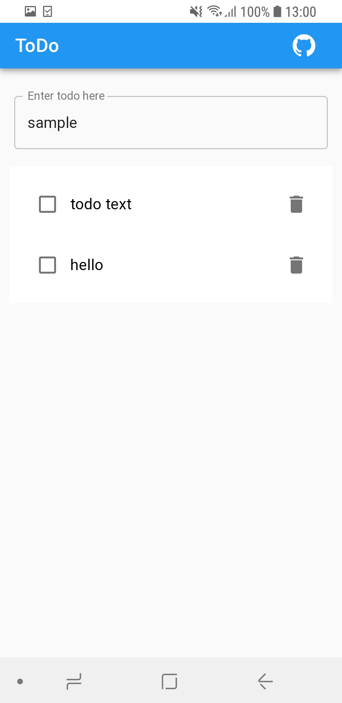
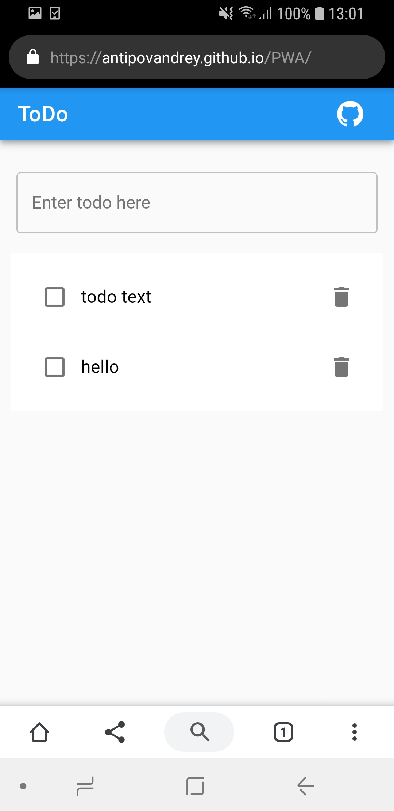
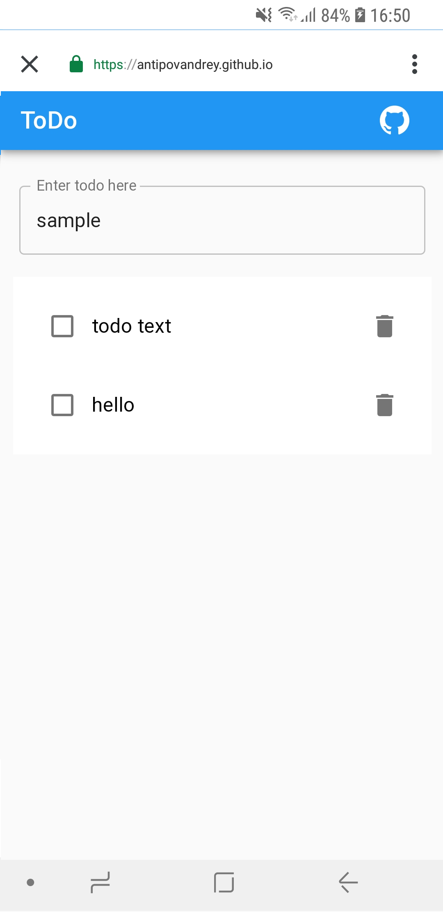

# Trusted Web Activity Sample

https://developers.google.com/web/updates/2019/02/using-twa

This repository contains both Android app and Web app.

The web app is a very simple ToDo Progressive Web Application with 100 performance scores in Chrome's LightHouse.
It uses service worker to be available offline and persists your data in browser's local storage.

The android app is built with a native screen and Chrome's Trusted Web Activity which is available in Chrome 72 and above.

Trusted Web Activity is the compilation of the best parts of WebView and Chrome Custom Tabs.
With TWA you can launch web app in your first-party android application without having a URL bar appeared like WebView allows, but run your PWA in up-to-date Chrome browser.

By using service worker (which is required for now) your web app can be loaded once and then be available offline.

To prove your application is trusted you have to put ```assetlinks.json``` file to the root of your web application.
The association is created via Digital Asset Links and the association must be established in both ways, linking from the app to the website and from the website to the app.
There is a ```assetlinks.json``` [generation](https://developers.google.com/digital-asset-links/tools/generator) tool which allows you generating the file and validating it's presence on the web app server


In order to be accepted by Google Play your PWA has to meet the same requirements as for being added your PWA to the home screen:
+ Includes a web app manifest with the required properties:
  + ```short_name``` or ```name```
  + icons must include a 192px and a 512px sized icons
  + ```start_url```
  + display must be one of: ```fullscreen```, ```standalone```, or ```minimal-ui```
+ Served over ```HTTPS```
+ Has registered a service worker with a fetch event handler

Built signed apk can be found here — [debug](https://github.com/AntipovAndrey/PWA/tree/master/android/app/debug) [release](https://github.com/AntipovAndrey/PWA/tree/master/android/app/release)

## Screenshots

Main (native) screen                            |  TWA with Digital Asset Link                    |  Same PWA opened in Chrome
:----------------------------------------------:|:------------------------------------------------:|:---------------------------------------------:
  |     | 


Unsigned TWA / no Digital Asset Link             |  External link opened
:-----------------------------------------------:|:------------------------------------------------------:
 | 


### References

https://developers.google.com/web/updates/2019/02/using-twa <br/>
https://developers.google.com/web/fundamentals/app-install-banners/#what_are_the_criteria <br/>
https://developers.google.com/digital-asset-links/tools/generator